# MHA - Mobile hydraulic aggregate (PHA - Pokretni hidraulični agregat)

## Introduction

During my internship in the Mihajlo Pupin Institute, I worked on a model of their product from headline [description of product](https://github.com/Dovlane/imp-pha/blob/main/IMP-PHA-SR.pdf).

## About the project

This program was designed to simulate the operation of the MHA (Mobile Hydraulic Aggregate). It consists of three subsystems:
<ol>
<li>An accumulator with a relief and overflow valve (7.0 on the actual MHP diagram).</li>
<li>A pump with its relief valve (1.0 and 2.0).</li> 
<li>A distributor with a cylinder and an accumulator (slightly different on the actual diagram, but essentially 3.0 and 6.0).</li>  
</ol>

Two PID controllers are used for the regulation and control of this system. One is used to maintain the pump pressure through the torque applied to the shaft (4). The other controls the position of the cylinder piston by managing the position of the sliding valve (5).

The pump pressure that is maintained is 2.5 [bar], and the pump's and accumulator's overflow valve (1) activates at 3 bars. The relief valves of the pump and accumulator operate according to a hysteresis characteristic (pH = 5 [bar], pL = 4.5 [bar]).
 

 
It is important to note that the piston stroke is monitored in a coordinate system with zero at point A and 0.1 [m] at point B.

## The actual diagram of the MHA (Mobile Hydraulic Aggregate)
 
 

 

## Diagram image in the program
 
 

 

In the following section, there are graphs where two different sequences of the desired positions of the cylinder piston were set. The first is a sine wave, and the second is a trapezoidal unipolar pulse train.
 

## Graphs

Below are two sets of graphs: the first set corresponds to the case where the desired piston position follows a sine wave, and the second set corresponds to the trapezoidal pulse. 
Note – the first graph corresponds to the Scope 1 graph, the second graph to Scope 2, and so on…

### Sine wave

#### 1. Graph
<table>
  <tr>
    <th>Yellow</th>
    <td>signal of the relief valve of the pump</td>
    <th>Dark blue</th>
    <td>flow of the overflow valve of the pump </td>
  </tr>
  <tr>
    <th>Orange</th>
    <td>flow of the accumulator (1. subsystem)</td>
    <th>Green</th>
    <td>signal for the relief valve of the accum. (1. subsystem)</td>
  </tr>
  <tr>
    <th>Purple</th>
    <td>pump's flow</td>
    <th>Light blue</th>
    <td>signal for the sliding valve</td>
  </tr>
</table>

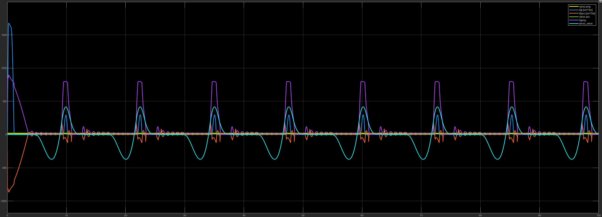
 

 

 
 

#### 2. Graph

<table>
  <tr>
    <th>Yellow</th>
    <td>signal of the relief valve of the pump</td>
    <th>Dark blue</th>
    <td>flow of the overflow valve of the pump </td>
  </tr>
  <tr>
    <th>Orange</th>
    <td>pressure of the accumulator (1. subsystem)</td>
    <th>Green</th>
    <td>signal for the relief valve of the accum. (1. subsystem)</td>
  </tr>
  <tr>
    <th>Purple</th>
    <td>pump's pressure</td>
    <th>Light blue</th>
    <td>signal for the sliding valve</td>
  </tr>
</table>

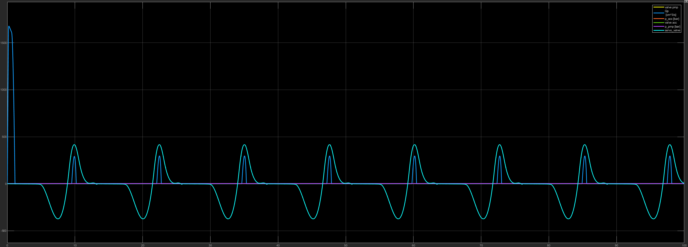
 
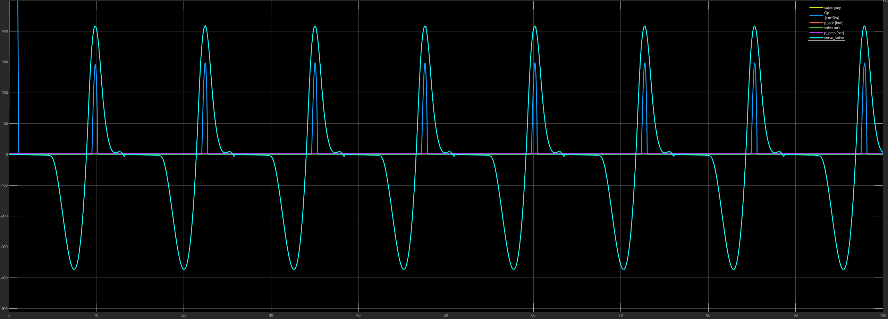
 

 
 

#### 3. Graph

<table>
  <tr>
    <th>Yellow</th>
    <td>Q_b - the actuator B of the sliding valve</td>
    <th>Dark blue</th>
    <td>signal for the sliding valve</td>
  </tr>
  <tr>
    <th>Orange</th>
    <td>Q_bt - the T connection of the sliding valve</td>
    <th>Green</th>
    <td>Qp_servo – the P connection of the sliding valve</td>
  </tr>
</table>

 

 

 
 

#### 4. Graph

<table>
  <tr>
    <th>Yellow</th>
    <td>torque – torgue on the shaft</td>
    <th>Dark blue</th>
    <td>p_pmp - pressure on the pump</td>
  </tr>
  <tr>
    <th>Orange</th>
    <td>desired_pres – desired pressure of the pump</td>
    <th>Green</th>
    <td>Qp – overflow of the pump</td>
  </tr>
</table>

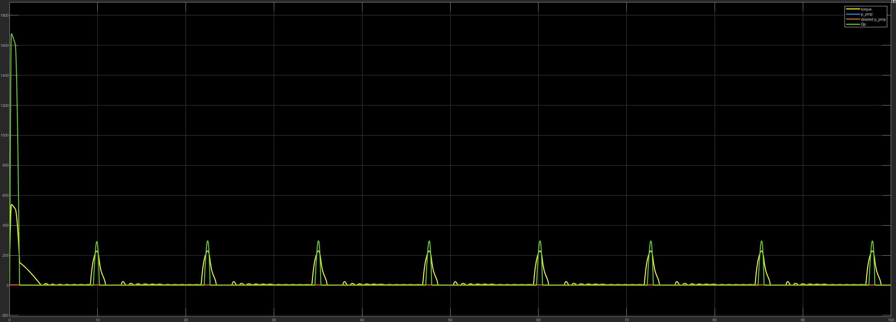
 
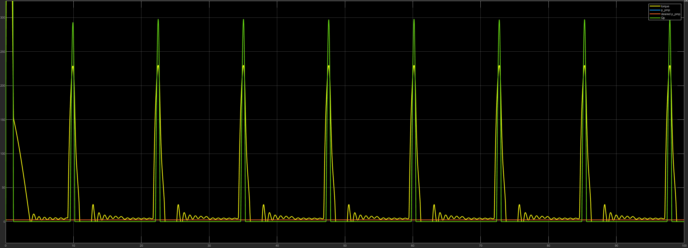
 

 
 

#### 5. Graph

<table>
  <tr>
    <th>Yellow</th>
    <td>p_acc2 – pressure of the accumulator (3. susbsystem) </td>
    <th>Dark blue</th>
    <td>Qpservo - P connection of the sliding valve</td>
  </tr>
  <tr>
    <th>Orange</th>
    <td>servo_valve – signal for the sliding valve</td>
    <th></th>
    <td></td>
  </tr>
</table>

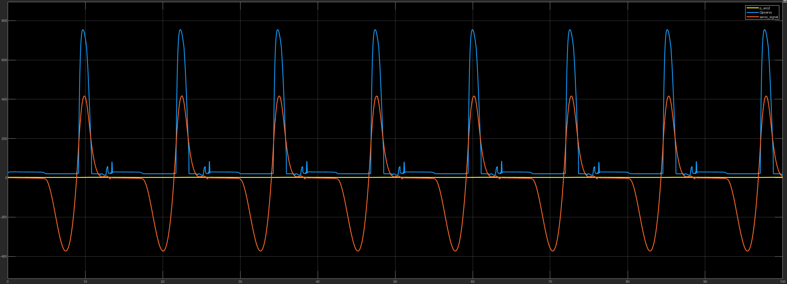
 
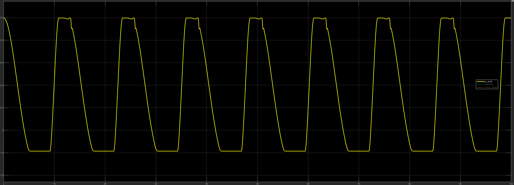
 
 

#### 6. Graph

<table>
  <tr>
    <th>Yellow</th>
    <td>piston_pos – piston's position</td>
    <th>Dark blue</th>
    <td>desired_pos – desired piston's position</td>
  </tr>
  <tr>
    <th>Orange</th>
    <td>p_pmp – pump's pressure/td>
    <th>Purple</th>
    <td>p_acc2 – pressure of the accumulator (3. susbsystem)</td>
  </tr>
</table>

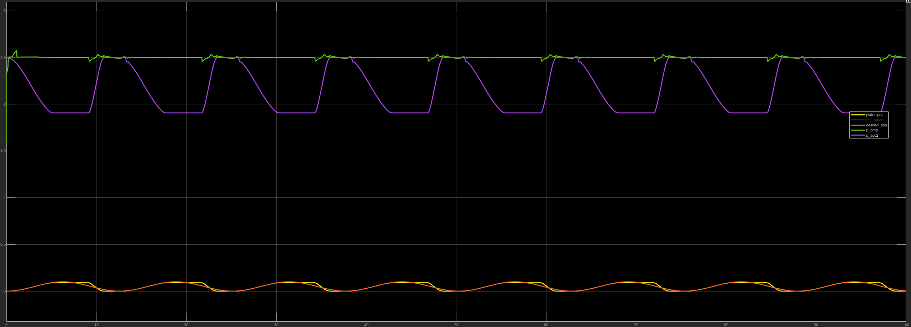
 
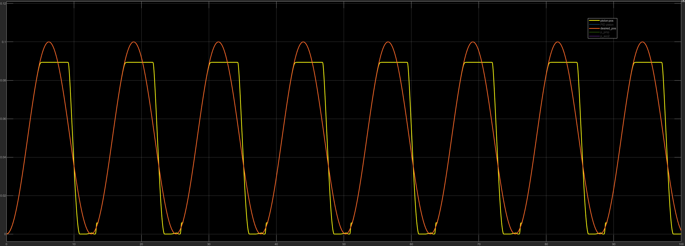
 
 

### Trapezoid pulse

#### 1. Graph
<table>
  <tr>
    <th>Yellow</th>
    <td>signal of the relief valve of the pump</td>
    <th>Dark blue</th>
    <td>flow of the overflow valve of the pump </td>
  </tr>
  <tr>
    <th>Orange</th>
    <td>flow of the accumulator (1. subsystem)</td>
    <th>Green</th>
    <td>signal for the relief valve of the accum. (1. subsystem)</td>
  </tr>
  <tr>
    <th>Purple</th>
    <td>pump's flow</td>
    <th>Light blue</th>
    <td>signal for the sliding valve</td>
  </tr>
</table>

 
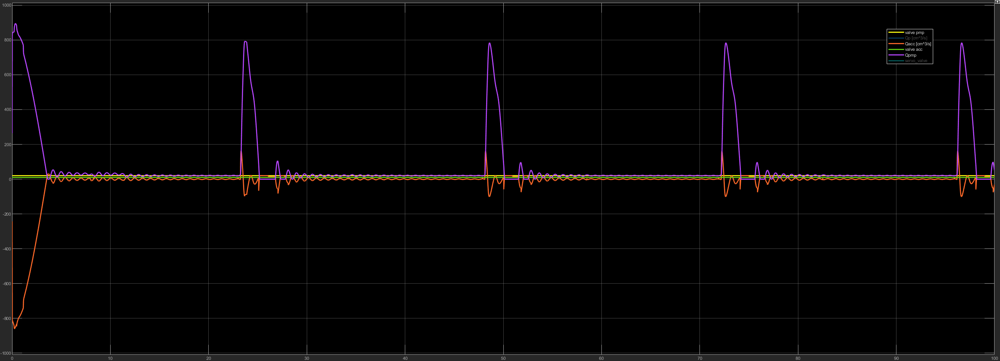
 
 

#### 2. Graph

<table>
  <tr>
    <th>Yellow</th>
    <td>signal of the relief valve of the pump</td>
    <th>Dark blue</th>
    <td>flow of the overflow valve of the pump </td>
  </tr>
  <tr>
    <th>Orange</th>
    <td>pressure of the accumulator (1. subsystem)</td>
    <th>Green</th>
    <td>signal for the relief valve of the accum. (1. subsystem)</td>
  </tr>
  <tr>
    <th>Purple</th>
    <td>pump's pressure</td>
    <th>Light blue</th>
    <td>signal for the sliding valve</td>
  </tr>
</table>

 
 

#### 3. Graph

<table>
  <tr>
    <th>Yellow</th>
    <td>Q_b - the actuator B of the sliding valve</td>
    <th>Dark blue</th>
    <td>signal for the sliding valve</td>
  </tr>
  <tr>
    <th>Orange</th>
    <td>Q_bt - the T connection of the sliding valve</td>
    <th>Green</th>
    <td>Qp_servo – the P connection of the sliding valve</td>
  </tr>
</table>

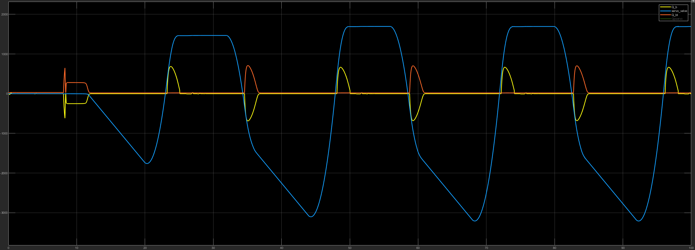
 

 
 

#### 4. Graph

<table>
  <tr>
    <th>Yellow</th>
    <td>torque – torgue on the shaft</td>
    <th>Dark blue</th>
    <td>p_pmp - pressure on the pump</td>
  </tr>
  <tr>
    <th>Orange</th>
    <td>desired_pres – desired pressure of the pump</td>
    <th>Green</th>
    <td>Qp – overflow of the pump</td>
  </tr>
</table>

 

 
 

#### 5. Graph

<table>
  <tr>
    <th>Yellow</th>
    <td>p_acc2 – pressure of the accumulator (3. susbsystem) </td>
    <th>Dark blue</th>
    <td>Qpservo - P connection of the sliding valve</td>
  </tr>
  <tr>
    <th>Orange</th>
    <td>servo_valve – signal for the sliding valve</td>
    <th></th>
    <td></td>
  </tr>
</table>

 

 
 

#### 6. Graph

<table>
  <tr>
    <th>Yellow</th>
    <td>piston_pos – piston's position</td>
    <th>Dark blue</th>
    <td>desired_pos – desired piston's position</td>
  </tr>
  <tr>
    <th>Orange</th>
    <td>p_pmp – pump's pressure/td>
    <th>Purple</th>
    <td>p_acc2 – pressure of the accumulator (3. susbsystem)</td>
  </tr>
</table>

 

 
 
